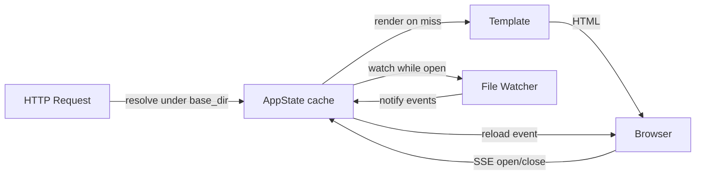
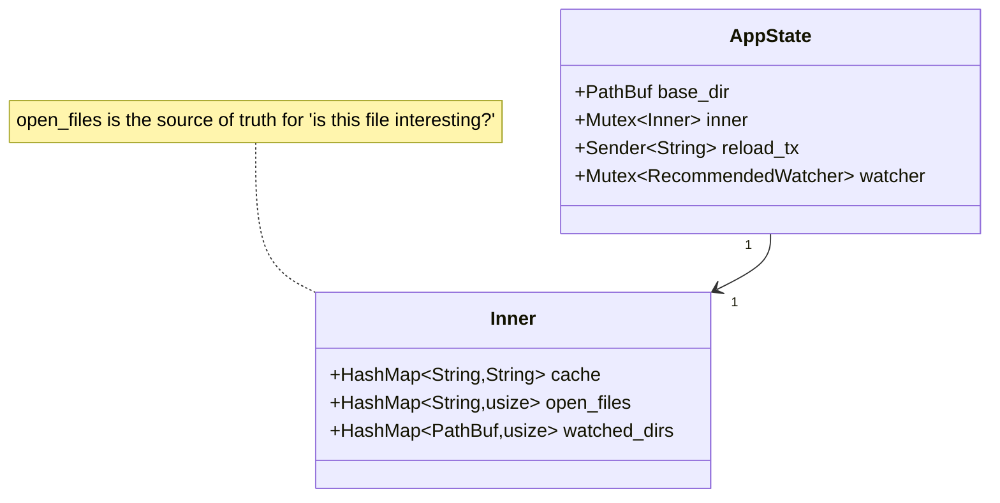
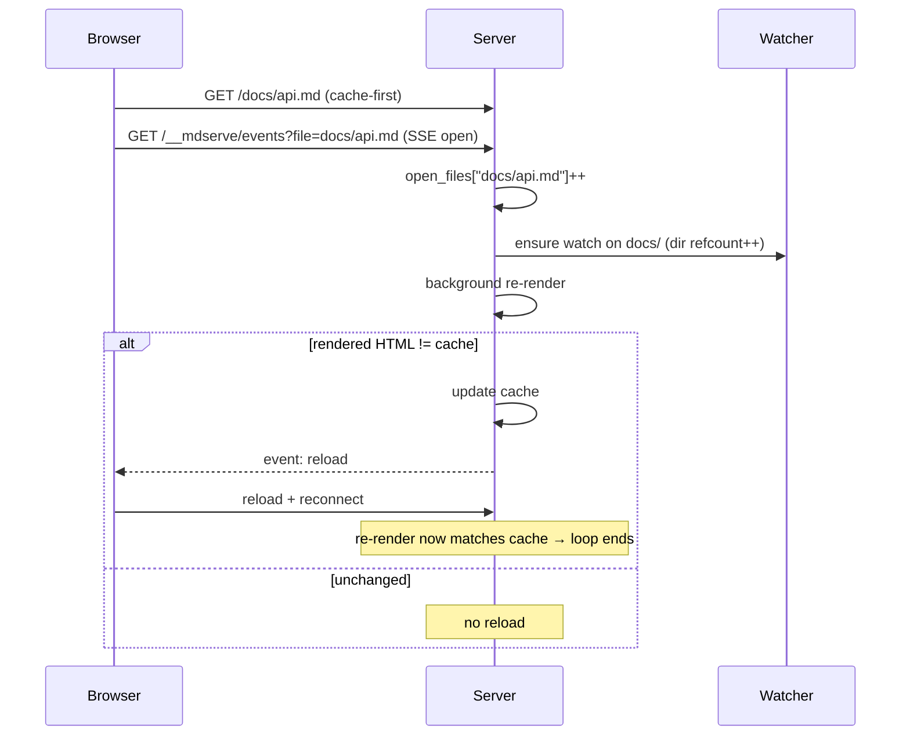
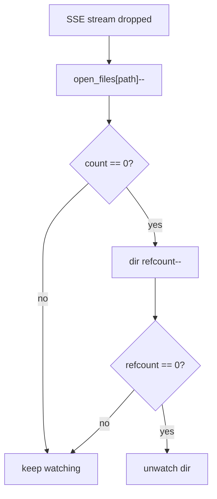

# mdserve Architecture

## Overview

mdserve is a simple HTTP server for markdown preview with live reload. Its
watching and caching are lazy and driven by the browser open/close lifecycle:
nothing is scanned, rendered, or watched up front. Work happens only for files
someone is actually looking at.

**Core principle**: `base_dir` is a security boundary, not a working set. Any
file under it is browsable; nothing above it is ever served.



## Browsing model

There is **no file-vs-directory mode** and **no sidebar**. The CLI takes an
optional `PATH` and an optional `--base-dir`:

```bash
mdserve                       # list the current directory
mdserve ./docs/api.md         # render docs/api.md
mdserve --base-dir ~/proj docs  # list ~/proj/docs, fenced to ~/proj
```

`--base-dir` defaults to the current directory so that a file opened in one
subdirectory can link to a sibling subdirectory (`../specs/server.md`) and still
resolve inside the fence. A path that resolves to a directory renders a
vim/netrw-style listing; navigation is browsing into directories plus links
between documents.

## Architecture

### State

Three pieces of state, plus the cache.



- **cache** — `relpath → rendered HTML`. Permanent and unbounded, no eviction.
  Updated on a render-on-miss and by the watcher / on-open re-render.
- **open_files** — `relpath → count` of connected SSE streams (markdown only).
  Two tabs on the same file → count 2. This map is the single source of truth
  for which files are "interesting", and it is mutated **only** by the SSE
  lifecycle. Filesystem events for any path not in this map are discarded.
- **watched_dirs** — `directory → refcount`. A single `RecommendedWatcher` is
  created at startup watching nothing; a directory is `watch()`ed on the first
  open file under it and `unwatch()`ed when the last one closes.

### Request handling

Cache-first. A render only happens on a cache miss or a background re-render.

```mermaid
flowchart TD
    A["GET /*path"] --> B{"resolve under base_dir"}
    B -->|escapes boundary| F403["403 Forbidden"]
    B -->|missing| F404["404 Not Found"]
    B -->|directory| L["render listing<br/>(subdirs + .md, dirs first)"]
    B -->|markdown| C{"in cache?"}
    C -->|hit| S["serve cached HTML"]
    C -->|miss| R["render + store"] --> S
    B -->|image (allowlist)| IMG["serve raw bytes<br/>SVG gets script-src 'none'"]
    B -->|other existing file| F404
```

The resolver rejects any `..` component lexically (403 even if the target is
missing), then canonicalizes and rejects symlink escapes outside `base_dir`.
Servable types are markdown (`.md`, `.markdown`) and images (`.png`, `.jpg`,
`.jpeg`, `.gif`, `.webp`, `.svg`, `.avif`, `.bmp`, `.ico`). Images are served
raw and are **not** watched; SVG carries `Content-Security-Policy:
script-src 'none'`. Any other existing file returns 404.

### Live reload (SSE)

The reload channel is **Server-Sent Events** at `/__mdserve/events?file=<relpath>`,
not WebSocket — the channel is one-way (server → browser) and `EventSource`
reconnects natively, so no hand-rolled reconnect loop is needed.

"Open" = the SSE stream is connected. "Closed" = the stream future is dropped
(tab closed, navigated away, reloaded, crashed). That drop is the reliable
lifecycle signal used for reference counting.

On open the server serves the cached HTML immediately, then re-renders in the
background and reloads **only if the freshly rendered HTML differs** from the
cache. This catches edits made while the file was closed, and it is loop-safe: a
reload reconnects the stream, which re-renders, which now matches the cache, so
no further reload fires.

A `: keepalive` comment is written down each stream every ~15s. The stream
future only resolves when a write fails, so this periodic write is what makes
drop-detection of ungraceful disconnects (discarded tabs, crashes) reliable.



### Change while open

inotify events are filtered against `open_files` (markdown only); events for any
path nobody is viewing are ignored, as are all non-markdown events. A bare
`remove`/`rename` does **nothing** on its own — only a reappearing path
(`remove → create`, rename-over, the editor atomic-save shape) or a `modify`
triggers a re-render, which reloads only if the HTML changed.

A genuine deletion needs no special case: it is a bare `remove` with no
following `create`, so it triggers nothing. The open page is left as-is, and a
manual refresh 404s because the resolver checks existence before the cache. The
`open_files` entry clears when the tab finally closes and its stream drops.

### Routing



Routes (the `/__mdserve/` prefix is reserved and registered first, so it always
wins over content):

- `GET /__mdserve/events?file=<relpath>` → `text/event-stream`. Open registers
  the watch + open-files entry; stream drop deregisters. Emits `reload` events.
- `GET /__mdserve/mermaid.min.js` → bundled Mermaid library, ETag-cached.
- `GET /` and `GET /*path` → resolved under `base_dir` (listing, markdown,
  image, 403, or 404 per the request-handling flow above).

### Rendering

Uses [MiniJinja](https://github.com/mitsuhiko/minijinja) (Jinja2 template
syntax) with templates embedded at compile time via
[minijinja_embed](https://github.com/mitsuhiko/minijinja/tree/main/minijinja-embed).
A single template renders both markdown pages and directory listings.

Template variables:

- `content`: the rendered HTML (markdown body, or the listing fragment)
- `mermaid_enabled`: conditionally includes Mermaid.js when diagrams are present
- `page_title`: derived from the file name (or path for listings)
- `reload_file`: the relpath, present only for markdown pages — gates the
  `EventSource` live-reload snippet. Listings omit it and get no reload channel.

## Design decisions

**Lazy, browser-driven.** Zero up-front cost: no directory scan, no eager
render, no inotify watch at startup. You pay only for files that are viewed.

**Boundary, not a working set.** `base_dir` fences what is servable; everything
under it is browsable, which is what lets documents link sideways.

**Render-on-miss + permanent cache.** Files render on first request and stay
cached; the watcher and the on-open re-render keep the cache fresh while a file
is open.

**Server-side logic.** Markdown rendering, resolution, listings, and reload
triggering live server-side. Client JavaScript is minimal (theme selection and
SSE reload execution).

## Known trade-offs

- SSE over HTTP/1.1 is capped at ~6 connections per origin; with many open tabs
  the 7th reload channel stalls until one frees. Fine for a local preview tool.
- Images are not watched: editing an image embedded in an open page does not
  auto-reload it. A manual refresh shows the new image.
